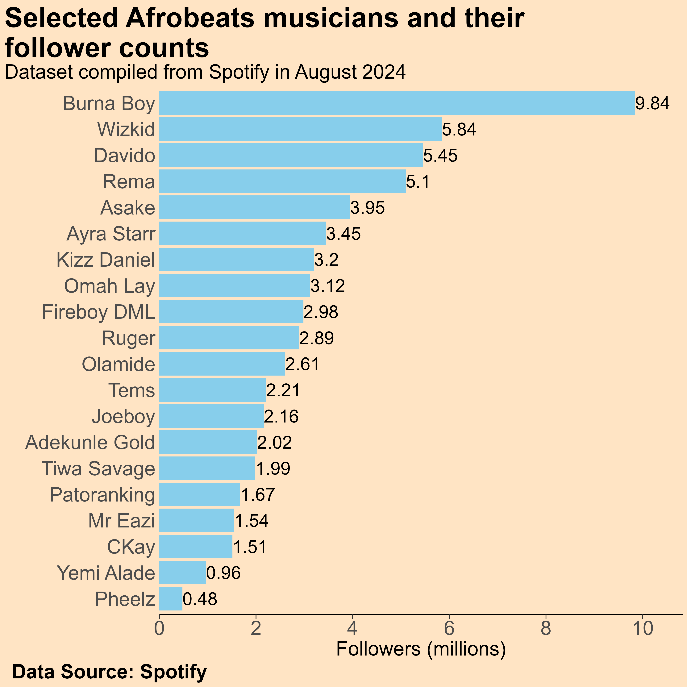
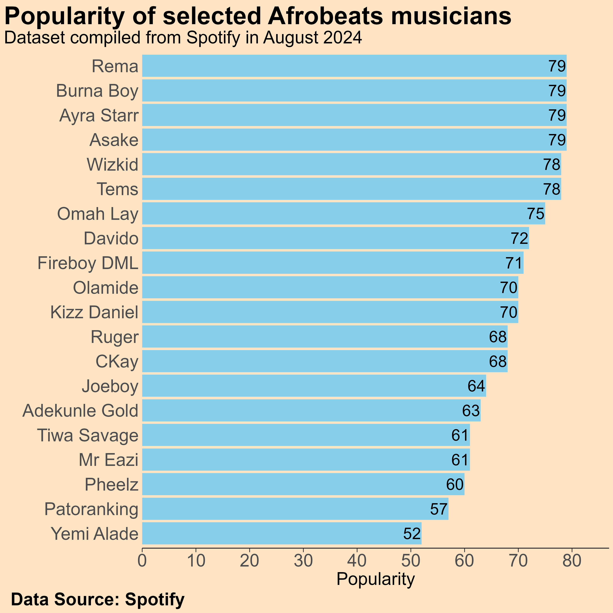

# Spotify Music Data Analysis

This repository contains the code used for analyzing musical data provided by Spotify (and a few other music data providers).

The main goal of this project is to gain insights into how different musical features contribute to the popularity and success of songs from different genres.

***NOTE: Direct links to the code used to produce the image(s) below will be provided ASAP (if not provided already).***

## Example visualizations

### 1) Spotify Follower Counts for Afrobeats Musicians

[Code](r_scripts/music/afrobeats_nigeria/part_2_artist_popularity_followers.R)

### 2) Afrobeats Musicians Popularity

[Code](r_scripts/music/afrobeats_nigeria/part_2_artist_popularity_followers.R)

